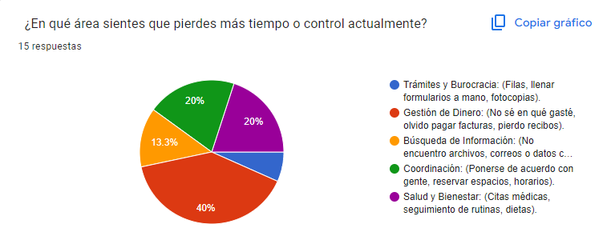
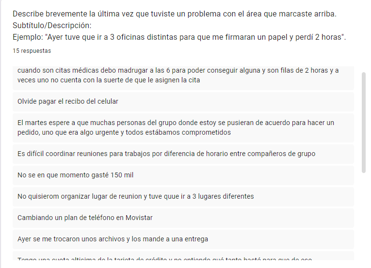
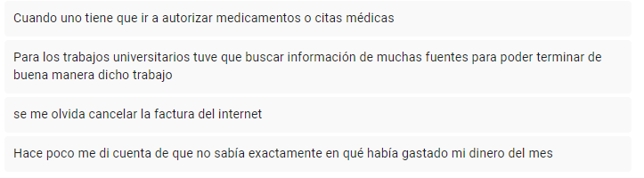
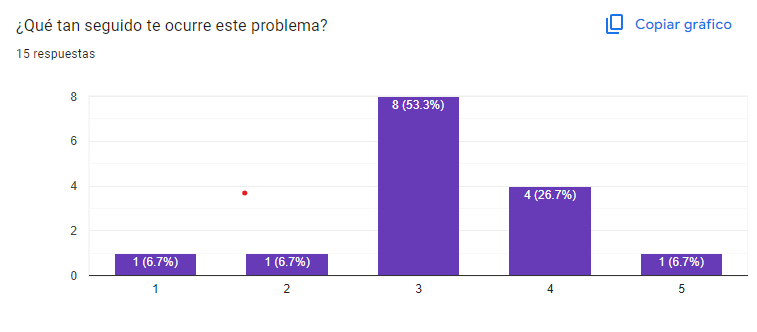
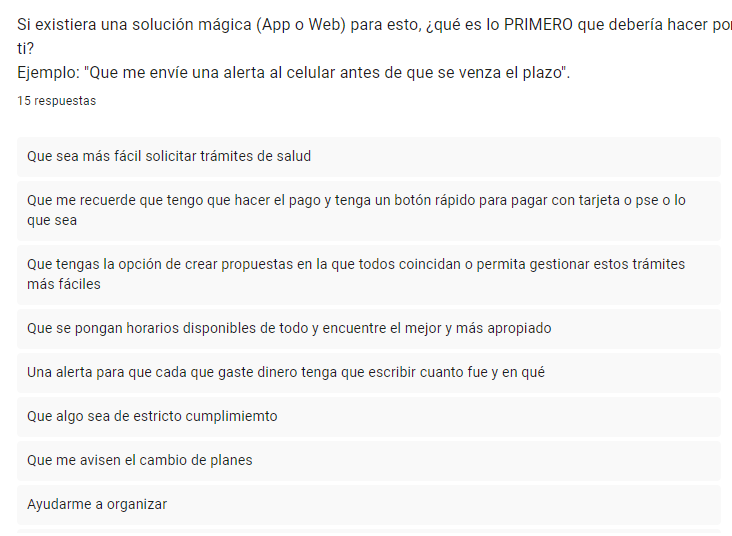
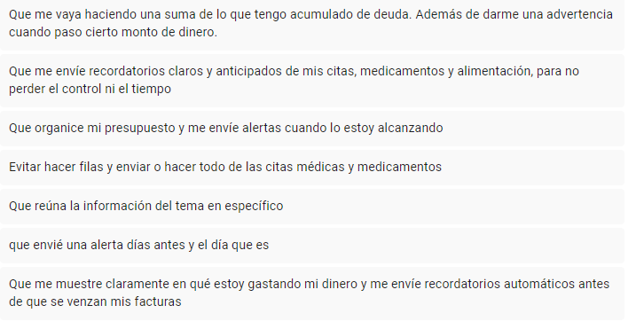
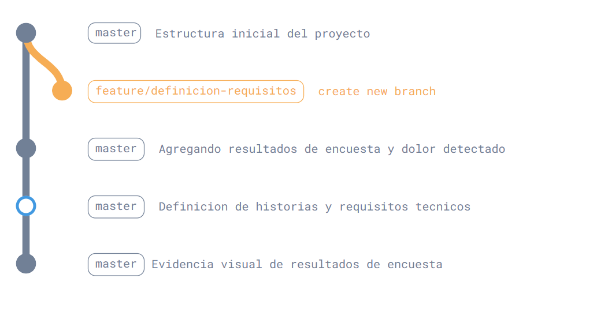

# Taller de Arquitectura

## Sección A: Evidencia de Campo (Discovery)

### El Problema
Las personas no tienen control claro sobre sus gastos diarios, lo que provoca olvidos en pagos, acumulación de deudas y la sensación constante de no saber en qué se gastó el dinero.

Una de las respuestas más representativas fue:
"No sé en qué momento gasté 150 mil pesos."

### Resultados de la Sonda
Se realizaron 12 encuestas a diferentes personas.

El 50% de los encuestados indicó que pierde más control en la gestión de su dinero, comunicando problemas como:
- Olvidar pagar facturas.
- No saber en qué se gastó el dinero del mes.
- Acumulación de pequeños gastos que terminan en una deuda alta.

Formulario utilizado: [https://docs.google.com/forms/d/e/1FAIpQLScB7vBtzbttnBxqdiKRZRzgVlut6g2-7djJTG1ObuoGLqTG_Q/viewform?usp=publish-editor]

#### Resultados visuales de la encuesta

**Pregunta 1: Área donde se pierde más control**

**Pregunta 2: Descripción del problema**

**Pregunta 3: Frecuencia del problema**

**Pregunta 4: Solución esperada**

## Evidencia Técnica: Git Graph

El siguiente diagrama representa el historial de commits y el uso de ramas durante el desarrollo del proyecto.

## Sección B: Definición de Requisitos (Definition)

### Historia de Usuario
Como persona que no lleva un control financiero constante, quiero registrar y visualizar mis gastos diarios, para entender en qué estoy usando mi dinero y evitar deudas innecesarias.

### Criterios de Aceptación
- El sistema debe permitir registrar un gasto en menos de 10 segundos.
- El sistema debe mostrar alertas cuando el usuario esté cerca de alcanzar su presupuesto.
- El sistema debe enviar recordatorios automáticos antes del vencimiento de facturas.
- El sistema debe conservar la información aunque el usuario cierre la aplicación.

### Requisitos Funcionales
- RF-01: El sistema debe permitir el registro manual de gastos indicando monto y categoría.
- RF-02: El sistema debe calcular automáticamente el total de gastos acumulados por mes.
- RF-03: El sistema debe enviar notificaciones cuando el gasto supere un monto definido por el usuario.

<!-- actualizacion para segundo commit -->
